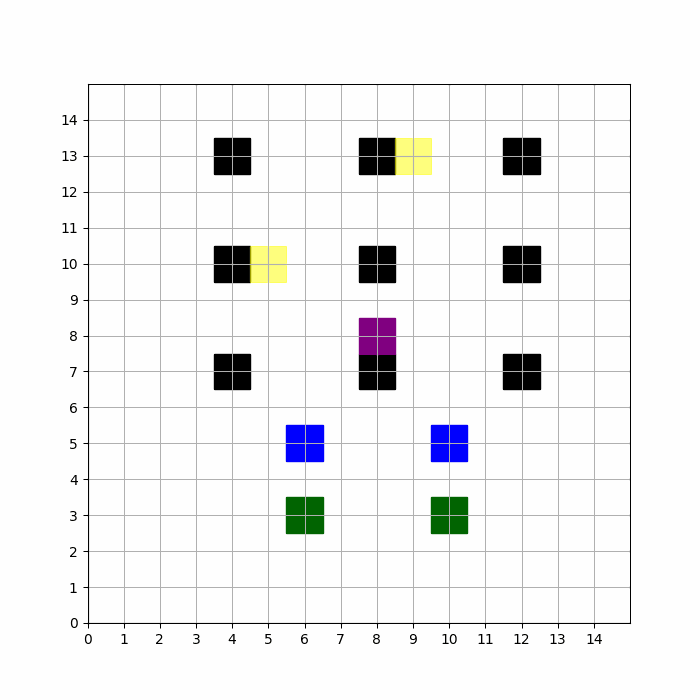
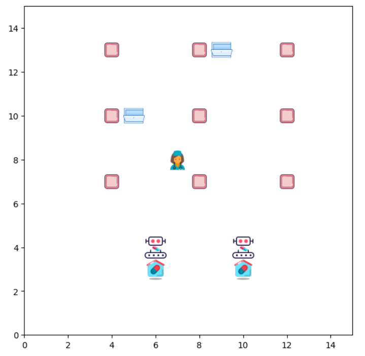
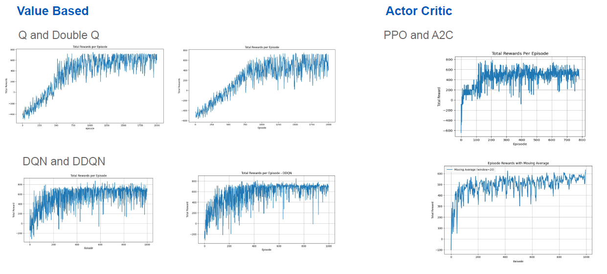
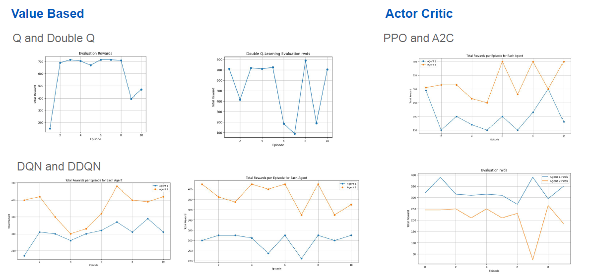

# RxRovers: Roaming for Rapid Relief

Dynamic Obstacles and Path Optimization

## Project Overview

"RxRovers: Roaming for Rapid Relief" aims to integrate advanced reinforcement learning (RL) into the healthcare domain, specifically focusing on optimizing medical supply delivery within hospital settings. This project seeks to deploy autonomous agents, RxRovers, which are programmed to navigate through hospital corridors efficiently, dodging any potential obstacles (dynamic and static) to ensure the timely distribution of medicines. This innovation can significantly enhance patient care and outcomes.

## Team Members

-   Charvi Kusuma [GitHub](https://github.com/kcharvi)
-   Tarun Reddi [GitHub](https://github.com/REDDITARUN)

### Real-World Application

The RxRovers project directly addresses a real-world healthcare problem: simulating delivery of medical supplies efficiently within hospital environments. This project integrates RL into the healthcare domain to enhance this delivery system, directly benefiting patient care and outcomes.

### Complex Navigation Challenges

The project’s challenges mirror real-world navigation complexities in hospital settings:

-   **Dynamic and Static Obstacles**: Accurate representation of unpredictable hospital environments.
-   **Path Planning**: Optimization to ensure timely and efficient delivery of medical supplies.

### Adaptable Environment

The project's environment can be modified to reflect various real-world hospital layouts, demonstrating its adaptability to different healthcare settings.

## Objectives

1. Develop RL agents capable of autonomously navigating hospital environments while delivering medical supplies.
2. Optimize path planning strategies to ensure timely and efficient delivery of medicines, while avoiding obstacles such as equipment, humans, and environmental constraints.
3. Enhance the visual representation and user experience of the simulated hospital environment to improve engagement and realism.
4. Conduct comparative analysis of various reinforcement learning algorithms to identify the optimal approach for medical supply delivery optimization within hospital environments.

## Environment

### Simulated Hospital Layouts

The project creates a hospital environment that mirrors real-world scenarios. The environment includes features such as:

-   **Hospital Corridors**: Multiple corridors, rooms, and operation desks.
-   **Obstacles**: Dynamic obstacles (humans, other rovers) and static obstacles (rooms, walls).
-   **RxRovers**: Autonomous agents programmed to navigate these environments, avoid obstacles, and reach designated destinations.

### Initial Stage

-   **Grid**: 9×9 grid simulating rovers navigating on a grid.
-   **Setup**: Initialized action and observation spaces, set up grid size, starting points, destinations, and parameters such as rewards and penalties for actions and events.

### Refined Version

-   **Grid Size**: 15×15 grid representing the hospital environment.
-   **Rovers**: Two agents represented by blue squares.
-   **Targets**: Yellow target destinations for delivering medicine.
-   **Actions**: Move down, up, left, right, or stay still (5 possible actions).
-   **Operation Desks**: Dark green squares representing starting points.
-   **Rooms**: Black squares indicating static obstacles.
-   **Human**: Purple square representing a moving human obstacle.
-   **Observation Space**: Positions of the Rovers, human, rooms, operation desks, and the grid boundary.
-   **Rewards**:
    -   +30 for moving closer to targets.
    -   +100 for reaching destinations.
    -   -15 for collisions or moving out of grid bounds.
    -   -5 for waiting near the human obstacle.
    -   -20 for moving away from targets.
-   **Termination**: Episode ends if both Rovers reach their targets or maximum time steps (20) are reached.

## Algorithms

### Q-Learning (QL)

Implemented Q-Learning for a rover agent navigating a grid environment.

-   **Settings**:
    -   State Representation: Positions of the two rovers and the human.
    -   Action Space: Move up, down, left, right, or stay in place.
    -   Rewards: Based on interactions (moving closer to target, collisions, reaching target).
    -   Done Flag: Episode terminates when both rovers reach targets or max time steps are reached.
-   **Hyperparameters**:
    -   Alpha (Learning Rate): 1e-4
    -   Gamma (Discount Factor): 0.9
    -   Epsilon (Exploration Rate): 0.5
    -   Epsilon Decay: 0.995
    -   Epsilon Minimum: 0.01
-   **Training Phase**:
    -   Total Rewards per Episode
    -   Epsilon Decay Curve
-   **Evaluation Phase**:
    -   Evaluation Rewards per Episode

### Double Q-Learning (DQL)

Implemented Double Q-Learning to mitigate overestimation biases.

-   **Settings**: Same as Q-Learning.
-   **Hyperparameters**: Same as Q-Learning.
-   **Training Phase**:
    -   Total Rewards per Episode
-   **Evaluation Phase**:
    -   Evaluation Rewards

### Deep Q Network (DQN)

Utilized a neural network to approximate the Q-values.

-   **Settings**:
    -   Neural Network Architecture: Two hidden layers with ReLU activation.
    -   Replay Memory: Stores past experiences for experience replay.
    -   Select Action Function: Epsilon-greedy strategy.
    -   Optimize Model Function: Gradient descent on the Q-network.
-   **Hyperparameters**:
    -   Number of Episodes: 1000
    -   Target Network Update Frequency: 10 episodes
    -   Batch Size: 256
    -   Discount Factor: 0.9
    -   Learning Rate: 0.001
    -   Epsilon Initial Value: 1
    -   Epsilon Final Value: 0.05
    -   Epsilon Decay: 10000
    -   Maximum Timestamps per Episode: 30
-   **Training Phase**:
    -   Total Rewards per Episode
    -   Epsilon Decay Curve
-   **Evaluation Phase**:
    -   Evaluation Rewards

### Double Deep Q Network (DDQN)

Addresses overestimation bias by decoupling selection and evaluation of the action.

-   **Settings**:
    -   Optimize Model Function: Gradient descent with gradients clipping.
-   **Hyperparameters**:
    -   Batch Size: 256
    -   Gamma: 0.9
    -   Learning Rate: 0.001
    -   Epsilon Start: 1
    -   Epsilon End: 0.05
    -   Epsilon Decay: 10,000
    -   Number of Episodes: 1000
    -   Target Update: Every 10 episodes
-   **Training Phase**:
    -   Total Rewards per Episode
    -   Epsilon Decay Curve
-   **Evaluation Phase**:
    -   Evaluation Rewards

### Proximal Policy Optimization (PPO)

A robust and efficient algorithm developed by OpenAI.

-   **Settings**:
    -   Neural Network Architecture: Actor and critic heads.
    -   Training Loop: States, actions, rewards, values, and log-probs collected in replay buffer.
    -   Loss Functions: Policy and value losses.
-   **Hyperparameters**:
    -   Total Timesteps: 50,000
    -   Gamma: 0.99
    -   Lambda: 0.95
    -   Epsilon: 0.2
    -   Epochs: 3
    -   Batch Size: 64
    -   Learning Rate: 0.001
-   **Training Phase**:
    -   Total Rewards per Episode
-   **Evaluation Phase**:
    -   Evaluation Rewards

### Actor Critic (A2C)

Combines elements of both policy-based methods (Actor) and value-based methods (Critic).

-   **Settings**:
    -   Actor Network: Learns a policy π(s).
    -   Critic Network: Learns the value function V(s).
    -   Advantage: Measures action quality.
    -   Policy and Value Function Updates: Gradient descent.
-   **Training Phase**:
    -   Total Rewards per Episode
-   **Evaluation Phase**:
    -   Evaluation Rewards

**Total Rewards Plot during Training:**

**Evaluation for 10 Timestamps:**

## Comparison

Comparison of different reinforcement learning algorithms and their performance:

| Aspect                    | Q-Learning              | Double Q-Learning       | DQN                  | DDQN                           | PPO                           | A2C                           |
| ------------------------- | ----------------------- | ----------------------- | -------------------- | ------------------------------ | ----------------------------- | ----------------------------- |
| Algorithm Type            | Model-free, Value-based | Model-free, Value-based | Value-based, Deep NN | Value-based, Deep NN           | Actor-Critic, Policy Gradient | Actor-Critic, Policy Gradient |
| Exploration-Exploitation  | Epsilon-greedy          | Epsilon-greedy          | Epsilon-greedy       | Epsilon-greedy                 | Continuous                    | Continuous                    |
| Stability & Learning Rate | No target network       | No target network       | Target network       | Double updates, target network | Adaptive, Gradient Clipping   | Adaptive, Entropy Bonus       |
| Convergence               | Slow                    | Moderate                | Fast                 | Faster                         | Fast                          | Moderate                      |
| Memory Requirements       | Low                     | Low                     | High                 | High                           | Moderate                      | Moderate                      |
| Adaptability              | Moderate                | Moderate                | Low to Moderate      | Low to Moderate                | High                          | Moderate                      |
| Generalization            | Low to Moderate         | Low to Moderate         | Low                  | Low                            | High                          | Moderate                      |

## Challenges Addressed

1. **Navigating a Dynamic World**: Rovers learned to dodge moving obstacles using dynamic obstacle handling techniques.
2. **Custom Paths for Diverse Layouts**: Environment adaptable to various hospital settings.
3. **Learning Optimal Path**: Rovers trained to take the shortest route to delivery rooms, avoiding obstacles.

## Bonus: Real-World Application

1. **Healthcare System Integration**: Enhances delivery system within hospital settings, benefiting patient care and outcomes.
2. **Simulating Hospital Layouts**: Reflects real-world scenarios with hospital corridors, obstacles, and RxRovers.
3. **Complex Navigation Challenges**: Optimizes path planning and avoids dynamic/static obstacles.
4. **Adaptable Environment**: Can be modified to different healthcare settings.

## References

1. [Deep Reinforcement Learning DQN for Multi-Agent Environment](https://medium.com/yellowme/deep-reinforcement-learning-dqn-for-multi-agent-environment-5f4fae1a9ff5)
2. [Warehouse Robot Path Planning](https://github.com/LyapunovJingci/Warehouse_Robot_Path_Planning) for path planning and optimization with obstacle avoidance.
3. [Reinforcement Learning (DQN) Tutorial | PyTorch Tutorials](https://pytorch.org/tutorials/intermediate/reinforcement_q_learning.html)
4. [Deep Q Learning (DQN) using PyTorch](https://medium.com/@vignesh.g1609/deep-q-learning-dqn-using-pytorch-a31f02a910ac)

---
